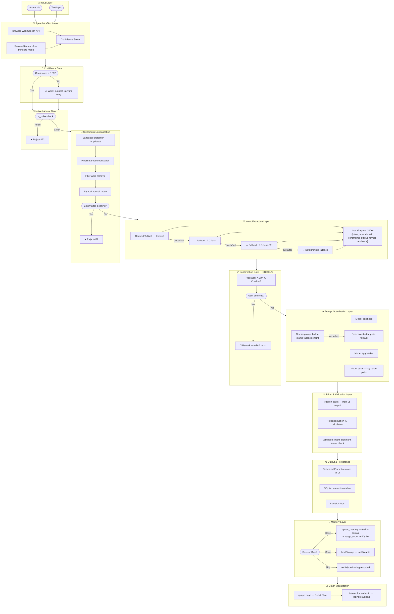

# Deterministic Multilingual Prompt Optimization Engine

## Problem statement

Noisy multilingual input often causes inconsistent, token-heavy prompts for downstream LLMs. This project provides a deterministic control layer that converts speech/text input into structured, validated, and token-efficient prompts.

This is **not** a chatbot. It is a pipeline that standardizes and optimizes prompts before they ever reach an LLM.

## Architecture diagram



## Tech stack

- Frontend: React (Vite), Tailwind CSS, React Flow
- Backend: FastAPI, Gemini API, Sarvam AI
- Storage: localStorage (last 5 memory entries), SQLite (production-ready schema)

## Deterministic system design

Determinism is enforced by:

- Fixed pipeline stage order
- Rule-based cleaning for filler/symbol normalization
- Deterministic optimization modes (`balanced`, `aggressive`, `strict`)
- Gemini calls configured with `temperature=0` (fallback to deterministic heuristics if unavailable)
- Explicit confirmation gate before final prompt reveal

## Features

- Hybrid STT: browser real-time transcript + Sarvam Saaras v3 fallback (`mode=translate`)
- Multilingual support (Hindi/Hinglish/English via translation path)
- Transcript source + confidence display
- Cleaning engine (filler removal, symbol normalization)
- Intent extraction into strict JSON shape
- Confirmation layer with Confirm/Rework
- Prompt optimization modes (balanced/aggressive/strict)
- Token stats with reduction %
- What Changed panel (removed/replaced/structured)
- Decision logs + session logs
- Save vs Skip memory workflow
- Memory cards (last 5 in localStorage)
- Graph visualization page (`/graph`) using stored interactions

## Backend API docs

Base URL: `http://localhost:8000`

---

### `GET /health`

Health check endpoint.

```bash
curl http://localhost:8000/health
```

**Response:**
```json
{ "status": "ok" }
```

---

### `POST /api/stt/translate`

Upload a WAV/M4A audio file. Calls Sarvam Saaras v3 in `translate` mode — transcribes and translates Hindi/Hinglish to English.

```bash
curl -X POST http://localhost:8000/api/stt/translate \
  -F "file=@recording.wav"
```

**Response:**
```json
{
  "text": "create a gym app launch plan",
  "language": "hi",
  "confidence": 0.9,
  "source": "sarvam"
}
```

**Error (empty audio):**
```json
{ "detail": "Empty audio file" }
```

---

### `POST /api/process`

Run the full deterministic pipeline: clean → detect language → extract intent → build optimized prompt → calculate token reduction.

```bash
curl -X POST http://localhost:8000/api/process \
  -H "Content-Type: application/json" \
  -d '{
    "raw_input": "ek marketing plan bana do for gym app",
    "mode": "balanced",
    "confidence": 0.88,
    "stt_source": "sarvam"
  }'
```

**`mode` options:** `balanced` | `aggressive` | `strict`

**Response:**
```json
{
  "raw_input": "ek marketing plan bana do for gym app",
  "normalized_text": "ek marketing plan bana do for gym app",
  "cleaned_text": "marketing plan create gym app",
  "language_detected": "hi-en",
  "intent": {
    "intent": "instruction",
    "task": "Create a 3-step marketing plan for a gym app",
    "domain": "marketing",
    "constraints": ["under 100 words"],
    "output_format": "bullet list",
    "audience": "general audience"
  },
  "confirmation_message": "You want Create a 3-step marketing plan for a gym app with bullet list. Confirm?",
  "optimized_prompt": "Create a 3-step marketing plan for a gym app. Output: bullet points. Constraint: under 100 words.",
  "mode": "balanced",
  "token_stats": {
    "input_tokens": 11,
    "output_tokens": 18,
    "reduction_percent": 32
  },
  "what_changed": {
    "removed_words": ["ek", "do"],
    "replaced_words": {"bana": "create"},
    "structured_output": { "intent": "instruction", "task": "...", "domain": "marketing", "output_format": "bullet list", "audience": "general audience" }
  },
  "decision_logs": [
    "STT source used: sarvam",
    "Incoming confidence: 0.88",
    "Language detected: hi-en",
    "Words removed: 2",
    "Intent confidence: 0.9",
    "Token reduction: 32%"
  ],
  "stt_source": "sarvam",
  "confidence": 0.88
}
```

**Error (noise input):**
```json
{ "detail": "Noise input detected. Please retry with clearer input." }
```

---

### `POST /api/memory/save`

Persist a task+domain entry in SQLite `memory` table. Merges (upserts) by task+domain and increments `usage_count`.

```bash
curl -X POST http://localhost:8000/api/memory/save \
  -H "Content-Type: application/json" \
  -d '{
    "task": "Create a 3-step marketing plan for a gym app",
    "domain": "marketing"
  }'
```

**Response:**
```json
{ "saved": true, "message": "Memory saved" }
```

---

### `GET /api/interactions`

Return stored pipeline interactions for graph visualization. Used by the `/graph` React Flow page.

```bash
curl "http://localhost:8000/api/interactions?limit=20"
```

**Response:**
```json
{
  "items": [
    {
      "id": 1,
      "raw_input": "ek marketing plan bana do for gym app",
      "normalized_text": "ek marketing plan bana do for gym app",
      "intent": {
        "task": "Create a 3-step marketing plan for a gym app",
        "domain": "marketing",
        "output_format": "bullet list"
      },
      "final_prompt": "Create a 3-step marketing plan for a gym app. Output: bullet points.",
      "created_at": "2026-04-26T12:00:00"
    }
  ]
}
```

## Data layer

SQLite schema is in `backend/schema.sql` and DB initialization script is `backend/init_db.py`.

Required tables:

- `interactions(id, raw_input, normalized_text, intent, final_prompt, created_at)`
- `memory(id, task, domain, usage_count)`

## Setup instructions

### 1) Backend

```powershell
cd c:\projects\Prompt\backend
python -m venv .venv
.\.venv\Scripts\Activate.ps1
pip install -r requirements.txt
copy .env.example .env
python init_db.py
uvicorn app.main:app --reload
```

### 2) Frontend

```powershell
cd c:\projects\Prompt\frontend
npm install
copy .env.example .env
npm run dev
```

## Example input/output

### Example input (Hinglish voice transcript)

`"uh ek fitness app ke launch ke liye concise bullet plan de do"`

### Extracted intent JSON

```json
{
  "intent": "instruction",
  "task": "fitness app launch plan",
  "domain": "fitness",
  "constraints": ["concise"],
  "output_format": "bullet list",
  "audience": "general audience"
}
```

### Strict mode optimized prompt

`task:fitness app launch plan | domain:fitness | format:bullet list | audience:general audience | constraints:concise`

## Demo checklist

- Voice input
- Browser transcript + confidence
- Sarvam fallback (High Accuracy Mode)
- Intent confirmation (Confirm/Rework)
- Mode switching
- Token reduction
- Save/Skip memory
- Memory cards
- `/graph` visualization

## Failure handling behavior

- Low confidence: UI suggests Sarvam retry
- Noise input: backend rejects with 422
- No intent/task: backend rejects with 422
- Wrong output: user can click Rework and rerun with edited input/mode

## Notes

- Set `GEMINI_API_KEY` and `SARVAM_API_KEY` in backend `.env` for production behavior.
- You can configure Gemini key fallback with `GEMINI_API_KEYS=key1,key2,key3` (comma-separated). If one key hits quota/rate limits, the backend automatically retries with the next key.
- If Gemini key is missing, deterministic fallback extraction is used.
